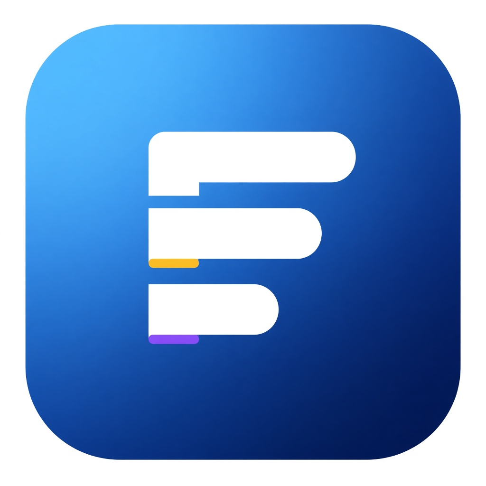

# Flowdeck



Multi-board Kanban for Mac (Electron) and the browser.

## Mac app (Electron)

```bash
cd frontend
npm install
npm run electron:dev
```

This starts Next.js and opens the Flowdeck desktop window.

### Build a Mac .app

```bash
cd frontend
npm run electron:build
```

Artifacts land in `frontend/release/` (including `Flowdeck.app` and a DMG).

The app icon lives at `frontend/build/icon.png` (also used as `public/icon.png` in the UI).

Data is stored on disk at:

`~/Library/Application Support/Flowdeck/workspace.json`

Boards can be exported/imported as `.flowdeck.json` files from the header controls.

## Browser (optional)

```bash
cd frontend
npm install
npm run dev
```

Open [http://localhost:3000](http://localhost:3000). In the browser, workspace state uses localStorage.

## Test

```bash
cd frontend
npm test
npx playwright install
npm run test:e2e
```
